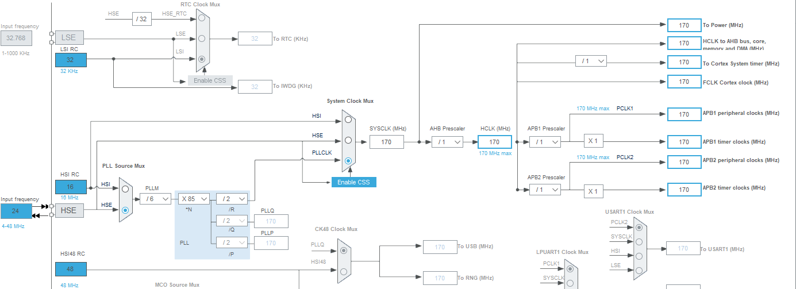
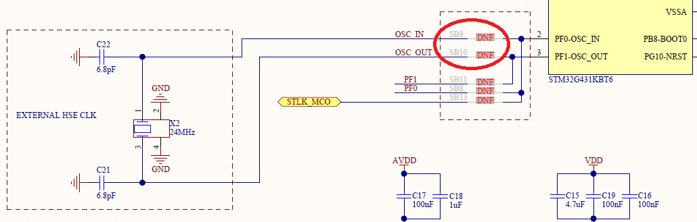

## blinky_adv

Realtime blinky example with FreeRTOS.

Default task loops with **exact 1s interval** and toggles an on-board LED. To get timing accuracy, two concepts are introduced.

1. Uses HSE 24MHz crystal osicllator instead of HSI RC oscillator. Crystal oscillator is more accurate and stable than HSI which has 1% accuracy. To implement HSE, you must short two solder bridges, SB9/SB10
1. Use osDelayUntil() instead of osDelay(). osDelayUntil() returns after **absolute deadline**. It does not affected by other tasks.

### CubeMX Settings
- Project is generated with STM32CubeIDE
  - Pinout & Configuration
    - System Core
      - RCC
        - HSE : Crystal/Ceramic Resonator
      - SYS
        - Timebase Source : TIM17
    - Middleware
        - FREERTOS
        - Interface : CMSIS_V2
        - Advanced settings
            - USE_NEWLIB_REENTRANT : Enabled
  - Clock Configuration
    
  - Project Manager
    - Code Generator
      - [x] Generate peripheral initialization as a pair of '.c/.h' files per peripheral

## NUCLEO Board Settings
- Close SB09, SB10
  
